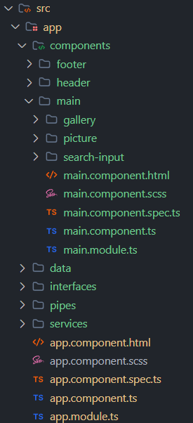
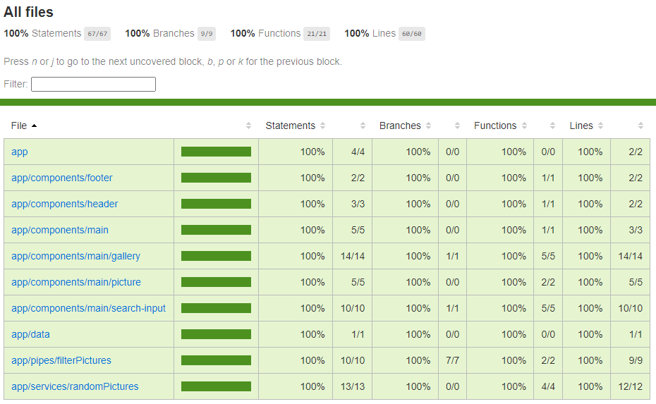
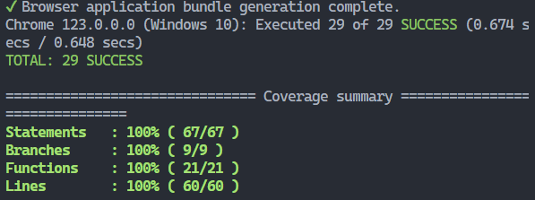

# Lista de Imágenes

https://github.com/AgusJP/Picture_list/assets/61051595/aa02c945-ab42-4f8c-8872-f41137c04dd0

## Descripción

Se trata de una prueba técnica en la que se debe generar un Array/Json random de 4000 elementos con la siguiente estructura:

```javascript
[
  {
  id: id_imagen,
  photo: url_photo,
  text: random_lorem_ipsum_text
  },
  .....
]
```

Mostrar estos elementos en pantalla y añadir un filtro para buscar por el ID y el texto. Se deben realizar test unitarios y test E2E.


## Scaffolding



## Versiones y Dependencias

- `Angular` CLI: 16.2.13
- `Node`: 16.20.2
- `Package Manager`: npm 8.19.4
- `Cypress`: 13.7.2
- `ngx-infinite-scroll`: 16.0.0
- `Typescript`: 5.1.3
- `jasmine-core`: 4.6.0
- `karma`: 6.4.0
- `karma-chrome-launcher`: 3.2.0
- `karma-coverage`: 2.2.0
- `karma-jasmine`: 5.1.0

## Scripts

```javascript
 "scripts": {
    "ng": "ng",
    "start": "ng serve",
    "build": "ng build",
    "watch": "ng build --watch --configuration development",
    "test": "ng test --code-coverage",
    "e2e": "npx cypress open",
    "format": "prettier --write 'src/**/*.{ts,html,css,scss,json}'",
    "linter": "eslint src"
  }
```

## Construir la aplicación en Local

Una vez clonado el repositorio, ejecuta `npm install` para instalar todas las dependencias y generar el **node_modules**

Ejecuta `ng serve -o` para un servidor de desarrollo. Navega a `http://localhost:4200/`. La aplicación se recargará automáticamente si cambias alguno de los archivos fuente.

## Construir de la aplicación para Producción

Ejecuta `ng build` para construir el proyecto. El código resultante será almacenados en el directorio `dist/`.

## Ejecución de Pruebas Unitarias





Ejecuta `npm run test` para ejecutar las pruebas unitarias a través de [Karma](https://karma-runner.github.io).

## Ejecución de Pruebas de E2E

https://github.com/AgusJP/Picture_list/assets/61051595/aa3fffac-9ae2-4e73-b20c-de6273a691f8

Ejecuta `npm run e2e` para ejecutar las pruebas e2e a través de [Cypress](https://www.cypress.io/).

## Ejecución con Docker
Si tienes docker instalado puedes generar la aplicación de la siguiente forma:
1. Ejecuta el siguiente comando para construir la imagen del contenedor.
```
docker build -t tagname .
```
2. Ejecutar el contenedor de la imagen ya construida.
```
docker run -d -it -p 80:80 tagname
```
Navega a `localhost:80` para visualizar la aplicación.
